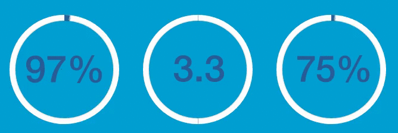

# Animated Circle Percentage

#### (actual rendering is smoother than the above .gif, of course =)

## How it works

* ```percentageCircle($percentBar, percent, barColor)``` will animate your circle by passing in the ```percentBar``` jQuery object, a ```percent```(eg. 75) for 75%, ```barColor``` (eg. '#C0C0C0')

## Technical

* The percentage bar will fill in about 1.5sec. For example, a 3% circle will fill much slower than a 95% circle, but both will be totally filled in 1.5sec at the same time.

* This utilizes css linear-gradient effect, creating this custom jQuery circle animation.

* Four overlapping circles composes this percentage circle. first circle is all white, second circle is the increasing percentage, third circle appears after second circle goes over 180deg, and inner most circle contains text
